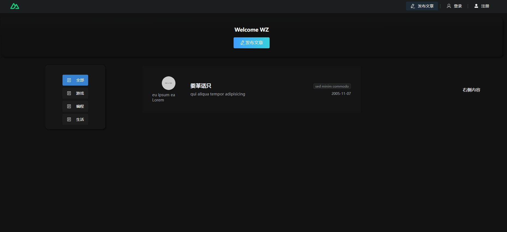
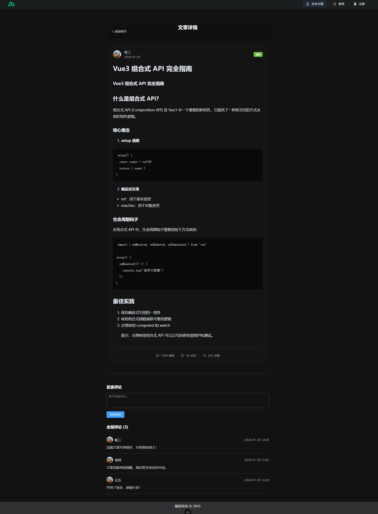

# WZ Forum - 一个现代化的论坛系统demo

## 项目预览

### 首页

- 顶部导航栏：包含 Logo、发布文章、登录和注册按钮
- 欢迎区域：显示欢迎信息和快捷发布按钮
- 左侧分类导航：文章分类快速筛选
- 中间内容区：文章列表展示
- 响应式设计：适配各种屏幕尺寸

### 文章详情页

- 文章内容：支持 Markdown 渲染
- 作者信息：头像、昵称、发布时间
- 文章分类：标签式分类展示
- 阅读数据：阅读量、评论数、点赞数
- 评论系统：支持用户互动

## 技术栈

- 前端框架：Nuxt 3
- UI 组件：Element Plus
- Markdown 支持：Marked
- 样式处理：CSS3 with Scoped Style
- 路由管理：Vue Router
- 状态管理：Vue Composition API


## 开发环境设置

确保安装所有依赖：

```bash
# npm
npm install

# pnpm
pnpm install

# yarn
yarn install

# bun
bun install
```

## 开发服务器

在 `http://localhost:3000` 启动开发服务器：

```bash
# npm
npm run dev

# pnpm
pnpm dev

# yarn
yarn dev

# bun
bun run dev
```

## 生产环境

构建生产版本：

```bash
# npm
npm run build

# pnpm
pnpm build

# yarn
yarn build

# bun
bun run build
```

本地预览生产构建：

```bash
# npm
npm run preview

# pnpm
pnpm preview

# yarn
yarn preview

# bun
bun run preview
```

更多信息请查看 [部署文档](https://nuxt.com/docs/getting-started/deployment)。

## 贡献指南

1. Fork 本仓库
2. 创建特性分支：`git checkout -b feature/AmazingFeature`
3. 提交更改：`git commit -m 'Add some AmazingFeature'`
4. 推送分支：`git push origin feature/AmazingFeature`
5. 提交 Pull Request

## 许可证

本项目采用 MIT 许可证 - 查看 [LICENSE](LICENSE) 文件了解详情。
